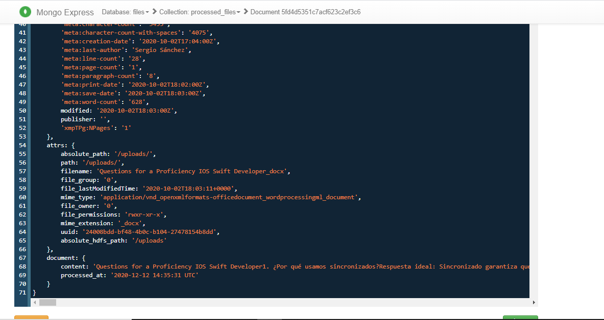

# A document search engine architectural approach
An architectural approach to implementing a large-scale document search engine based on Apache Nifi.

## Main Components

* ETL process design based on Apache Nifi's flow-based programming model to proccess and extract all metadata and content from each files.
* Microservice architecture to interact with the platform. Concretely we can get metadata from a specific file, launch a new file processing, make a complex queries to search files that have a specific term into their content.

## Main Goals

* It should have a fast and efficient search, providing the same search experience as others engine search.
* All text in documents (including their content) must be extracted and indexed.
* The architecture should be scalable, it must use technological references in the movement of data.
* It should be able to handle a large number of files of various formats and some quite large.
* It should be optimized to store large amounts of data and maintain multiple copies to ensure high availability and fault tolerance.
* It should have the ability to integrate with external systems to collaborate on more complex tasks or simply define platform usage schemes.

## Architecture Overview

### Several things to be consider

* I am using a HDFS Cluster with 3 datanodes to store the original files that they will be process.
* I am using two versions of Apache Tika server, one of them has a OCR capabilities to extract content from images or proccess scanned pdfs.
* I am using an SFTP server as the entry point for the Nifi ETL process, a microservice will upload the file into a share directory, then a processor from nifi will try to poll continuously wheather a new file has been added.
* A easy and quick way to explain how the Nifi ETL process works, is that it moves the file to the HDFS directory and then try to get their MIME type and considering this make a HTTP request to the more adequeate Apache Tika server to get all metadata and text content from this. To end, will try to store all this information into a MongoDB collection and publish serveral records in Kafka of inform the process state.
* It is necessary to moves this information to elasticsearch for make a complex searches, due to, MongoDB don't have a powerful capabilities in this aspect. For that, I am using a Logstash pipeline that allows to sync MongoDB's documents to a elasticsearch index.
* I am using two poweful tools to explore the data that has been indexed and stored, one of them is MongoDB Express to explore the MongoDB collection and the other is Kibana to check hearbeat of the ELK Stack and show the data has been indexed until now.

### Containers Ports

| Container | Port |
| ------ | ------ |
| Apache Nifi Dashboard UI | localhost:8080 |
| Hadoop Resource Manager | localhost:8081 |
| Kafka Topics UI | localhost:8082 |
| MongoDB Express | localhost:8083 |
| Kibana | localhost:8084 |
| Keycloak PGAdmin | localhost:8085 |
| Keycloak Admin UI | localhost:8086 |
| Consul Dashboard | localhost:8087 |
| Rabbit MQ - Stomp Dashboard | localhost:8088 |
| Hadoop NameNode Dashboard | localhost:8089 |
| API Gateway SSH  | localhost:2223 |
| SFTP Server | localhost:2222 |

## Some screenshots

### Apache Nifi

### Apache Kafka

### Apache Hadoop HDFS

### MongoDB

### Consul 

### Keycloak

### Gateway

### ELK Stack

