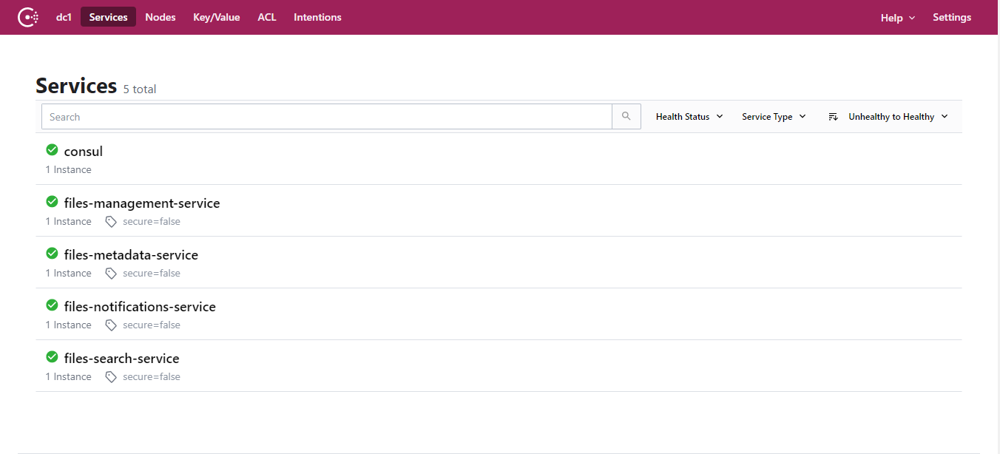
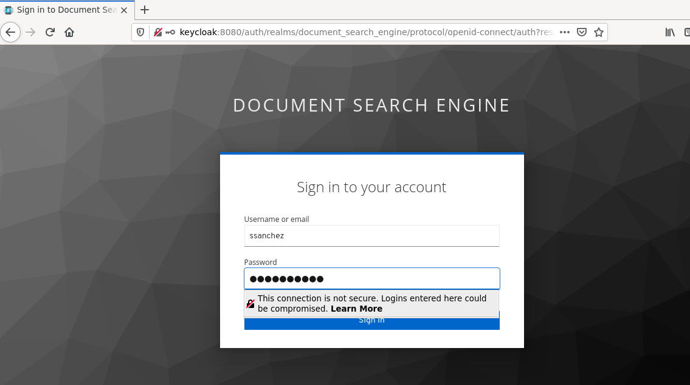

# A document search engine architectural approach
An architectural approach to implementing a large-scale document search engine based on Apache Nifi.

## Main Components

* ETL process design based on Apache Nifi's flow-based programming model to proccess and extract all metadata and content from each files.
* Microservice architecture to interact with the platform. Concretely we can get metadata from a specific file, launch a new file processing, make a complex queries to search files that have a specific term into their content.

## Main Goals

* It should have a fast and efficient search, providing the same search experience as others engine search.
* All text in documents (including their content) must be extracted and indexed.
* The architecture should be scalable, it must use technological references in the movement of data.
* It should be able to handle a large number of files of various formats and some quite large.
* It should be optimized to store large amounts of data and maintain multiple copies to ensure high availability and fault tolerance.
* It should have the ability to integrate with external systems to collaborate on more complex tasks or simply define platform usage schemes.

## Architecture Overview

### Several things to be consider

* I am using a HDFS Cluster with 3 datanodes to store the original files that they will be process.
* I am using two versions of Apache Tika server, one of them has a OCR capabilities to extract content from images or proccess scanned pdfs.
* I am using an SFTP server as the entry point for the Nifi ETL process, a microservice will upload the file into a share directory, then a processor from nifi will try to poll continuously wheather a new file has been added.
* A easy and quick way to explain how the Nifi ETL process works, is that it moves the file to the HDFS directory and then try to get their MIME type and considering this make a HTTP request to the more adequeate Apache Tika server to get all metadata and text content from this. To end, will try to store all this information into a MongoDB collection and publish serveral records in Kafka of inform the process state.
* It is necessary to moves this information to elasticsearch for make a complex searches, due to, MongoDB don't have a powerful capabilities in this aspect. For that, I am using a Logstash pipeline that allows to sync MongoDB's documents to a elasticsearch index.
* I am using two poweful tools to explore the data that has been indexed and stored, one of them is MongoDB Express to explore the MongoDB collection and the other is Kibana to check hearbeat of the ELK Stack and show the data has been indexed until now.
* The microservice architecture is coordinate for a consul agent, is continuously check the availability of each service and it allows to query the network location of each service registered.
* All services exposed of each services require authentication and authorization, therefore, it is necessary get a identity from the SSO Keycloak Server through the API Gateway Service.
* The API Gateway microservice unifies all APIs into a single API (using Spring Cloud Gateway for that), therefore, only will be necessary knows the location of gateway to interact with the platform.

## Used technology

* Spring Boot 2.3.5 / Apache Maven 3.6.3.
* Spring Boot Starter Actuator.
* Spring Cloud Stream.
* Spring Cloud Gateway.
* Spring Cloud Starter Consul Discovery.
* Spring Cloud Starter OpenFeign.
* Springdoc OpenApi.
* Spring Boot Starter Security.
* Spring Security OAuth2.
* ElasticSearch - Logstash - Kibana (ELK Stack).
* MongoDB.
* Mongo DB Express (Web-based MongoDB admin interface, written with Node.js and express).
* Consul Server.
* SSO Keycloak Server.
* Hadoop HDFS.
* Apache Nifi.
* Apache Tika Server.
* Rabbit MQ / STOMP protocol.
* Apache Kafka.
* Kafka Rest Proxy

## Running Applications as Docker containers.

### Rake Tasks

The available tasks are detailed below (rake --task)

| Task | Description |
| ------ | ------ |
| check_deployment_file_task | Check Deployment File |
| check_docker_task | Check Docker and Docker Compose Task |
| cleaning_environment_task | Cleaning Evironment Task |
| deploy | Deploys the Document Search Engine architecture and laun... |
| login | Authenticating with existing credentials |
| start | Start Containers |
| status | Status Containers |
| stop | Stop Containers |
| undeploy | UnDeploy Document Search Engine architecture |

To start the platform make sure you have Ruby installed, go to the root directory of the project and run the `rake deploy` task, this task will carry out a series of preliminary checks, discard images and volumes that are no longer necessary and also proceed to download all the images and the initialization of the containers.

### Containers Ports

In this table you can view the ports assigned to each service to access to the Web tools or something else you can use to monitoring the flow.

| Container | Port |
| ------ | ------ |
| Apache Nifi Dashboard UI | localhost:8080 |
| Hadoop Resource Manager | localhost:8081 |
| Kafka Topics UI | localhost:8082 |
| MongoDB Express | localhost:8083 |
| Kibana | localhost:8084 |
| Keycloak PGAdmin | localhost:8085 |
| Keycloak Admin UI | localhost:8086 |
| Consul Dashboard | localhost:8087 |
| Rabbit MQ - Stomp Dashboard | localhost:8088 |
| Hadoop NameNode Dashboard | localhost:8089 |
| API Gateway SSH  | localhost:2223 |
| SFTP Server | localhost:2222 |

## Some Videos

## Some screenshots

As follow, I include some images that help us to understand the performance of each part of system

### ETL Flow based on Apache Nifi

Apache NiFi supports powerful and scalable directed graphs of data routing, transformation, and system mediation logic.

### Events System based on Apache Kafka

Apache Kafka is an open-source distributed event streaming platform used by thousands of companies for high-performance data pipelines, streaming analytics, data integration, and mission-critical applications.

### Apache Hadoop HDFS to store the files that will proccess

The Hadoop Distributed File System (HDFS) is a distributed file system designed to run on commodity hardware. It has many similarities with existing distributed file systems. However, the differences from other distributed file systems are significant. HDFS is highly fault-tolerant and is designed to be deployed on low-cost hardware. HDFS provides high throughput access to application data and is suitable for applications that have large data sets. HDFS relaxes a few POSIX requirements to enable streaming access to file system data. HDFS was originally built as infrastructure for the Apache Nutch web search engine project. HDFS is now an Apache Hadoop subproject.

### MongoDB to store the metadata and content of the files that have been proccessed.

### Consul to coordinate microservices architecture. 

### SSO Keycloak Server

### The entry point to the architecture.

### ELK Stack

